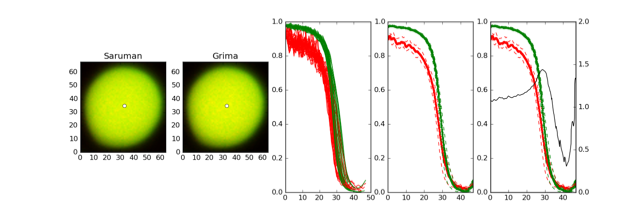

# Sauron

**sauron** is a software package which finds ring-like regions of increased density from one channel (Green) over another (Red) of a tiff file.



## Install

sauron can be installed with `python3 setup.py install`.

## Sauron

**sauron** can be used to search for rings on all Z-slices of a .tiff file in parallel.

### Usage

```
$ sauron -h
    Usage: sauron -d datadir -i imgname -r r_num -g g_num -t tmpdir -o outdir
                 [-M nMB] [-P project_name] [-J job_name] [-Z nZs] [-h]
    datadir ........ Directory where input .tif files are located
    imgname ........ Base name of .tif files (without R/G specified suffixes)
    r_num .......... Name of red signal (ex. A640)
    g_num .......... Name of green signal (ex. A488)
    tmpdir ......... Location where temporary data should be stored
    imgdir ......... Location where final cell images should be stored
    nMB ............ Number of MB to be requested from LSF (default: 500)
    project_name ... Project name to submit with (default: sauron)
    jobname ........ Job name to submit with (default: sauron)
    nZs ............ Number of Z stacks (default: 100)
```

## Saruman

**saruman** is called by **sauro** on each slice, but can also be used
interactively to search for rings on a specific slice.

### Usage

```

$ saruman -h
usage: Saruman [-h] -r RED_FILE -g GREEN_FILE -z IZ -t TMPDIR -o OUTDIR

optional arguments:
  -h, --help            show this help message and exit
  -r RED_FILE, --red_file RED_FILE
                        TIF file containing red signal.
  -g GREEN_FILE, --green_file GREEN_FILE
                        TIF file containing green signal.
  -z IZ, --iz IZ        Z stack to analyze.
  -t TMPDIR, --tmpdir TMPDIR
                        Pre-existing tmp directory to use.
  -o OUTDIR, --outdir OUTDIR
                        Pre-existing output directory to use.
```

## Testing

Example data can be found in `tests/data` and tests can be run from the root directory
with `python3 -m unittest discover tests test*.py` from the root directory.


